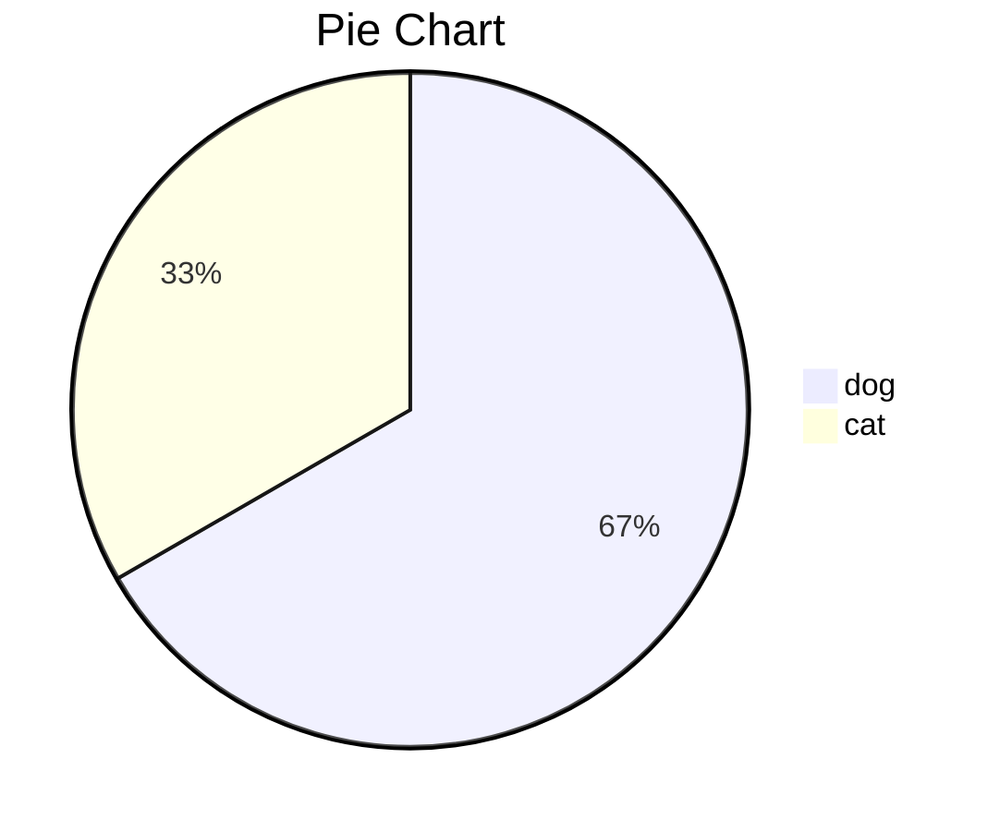

## 前言

以前看jvm相关的资料看了忘、忘了看，总是在硬背和“条件反射间”反复横跳；最近在实战中加深了java对堆内外内存、cpu的操作理解；所以尝试用实战方式讲解一下jvm的相关内容；分为几篇内容来介绍，本篇是第一篇；

1. 小白写的JVM详解指北：jvm的内存结构；
2. 未完；


## 1.一个Java程序从编译、启动到消亡

*Java虚拟机（Java Virtual Machine）*简称JVM，一种能够执行**Java字节码**的虚拟机，以**堆栈结构**机器来实现。

[^Wiki]: Java虚拟机

一段众所周知的代码：

```java
package org.example;

public class Main {
    public static void main(String[] args) {
        System.out.println("hello world");
    }
}
```

Java类的生命周期，从JVM的角度看可以总结为四个步骤：编译->加载->初始化->执行->卸载；

1. 编译:语法分析->语义分析->注解处理，**生成class文件**。
2. 加载:
        装载:**把class文件装载至JVM**。
        连接:校验class信息、**分配内存空间**及赋默认值。
        初始化:为变量赋值为正确的初始值。
3. 解释:字节码转换成操作系统可识别的执行指令。
4. 执行:操作系统识别解释阶段生成的指令，调用系统的硬件执行最终的程序指令。
5. 卸载：

### 1.1元空间(metaspace)

> [!IMPORTANT]
>
> 程序执行前，先要给class分配内存；

JDK1.8以前 JVM有方法区，也叫永久代(permanent generation)，方法区用于存放已被虚拟机加载的类信息、常量、静态变量，即编译器编译后的代码；1.8后，众所周知**元空间(metaspace)**代替了永久代，class这些静态的数据可以看做是class的基础元数据，内存也就被分配在元空间里；


